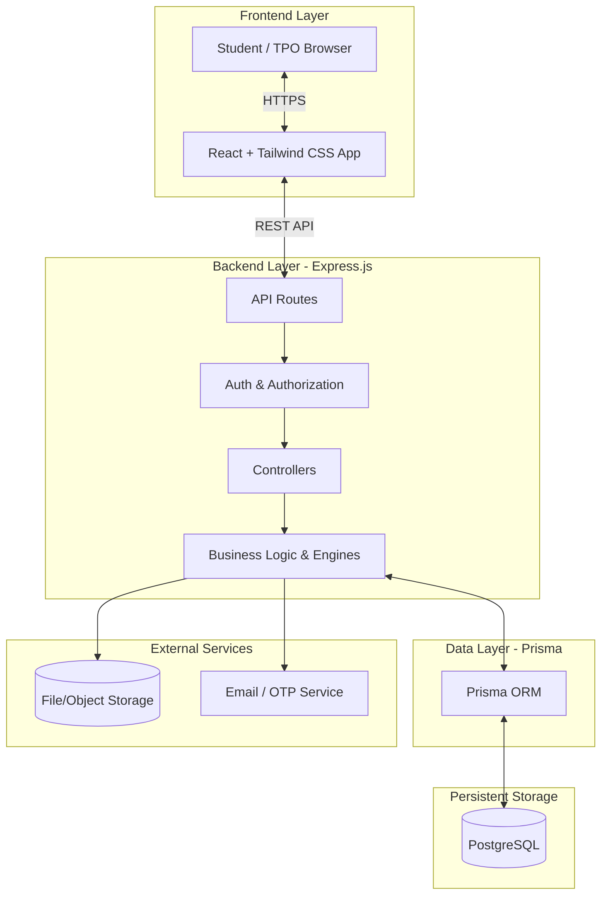
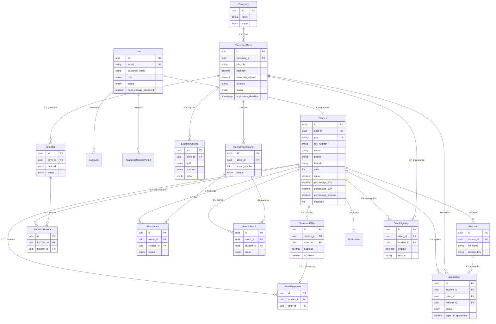
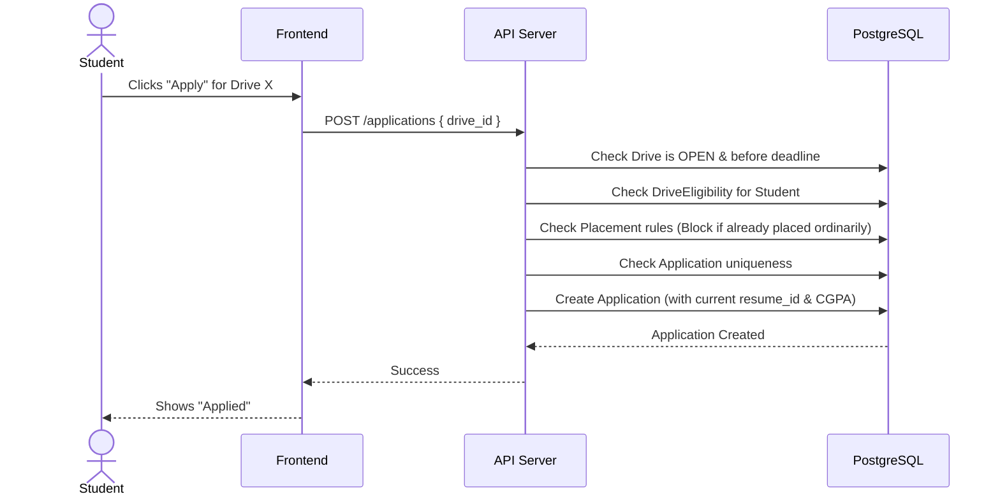
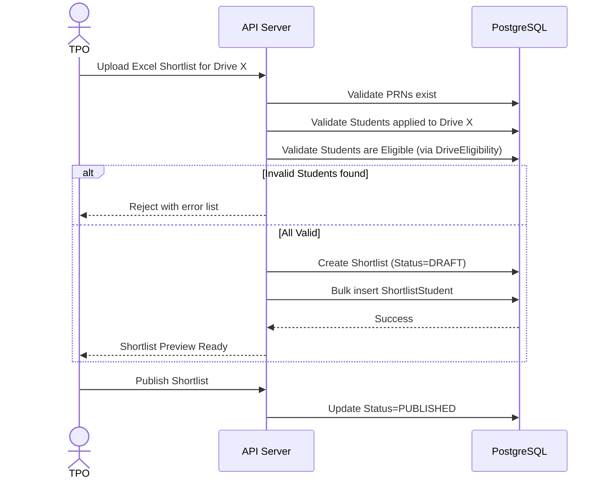

# Architecture Reference Document: College Placement Management System

## 1. System Architecture Diagram

## 2. Entity-Relationship (ER) Diagram

## 3. Relational Schema & Constraints

| Entity | Column | Type | PK/FK | Nullable | Unique | Description |
|---|---|---|---|---|---|---|
| **User** | `id` | UUID | PK | No | Yes | Primary identifier |
| | `email` | VARCHAR | - | No | Yes | Unique login email |
| | `password_hash` | VARCHAR | - | No | No | Hashed password |
| | `role` | ENUM | - | No | No | `STUDENT`, `TPO` |
| | `status` | ENUM | - | No | No | `ACTIVE`, `LOCKED`, `DISABLED` |
| | `must_change_password`| BOOLEAN | - | No | No | True for imported accounts |
| **Student** | `id` | UUID | PK | No | Yes | Primary identifier |
| | `user_id` | UUID | FK(User) | No | Yes | Maps 1:1 to User |
| | `prn` | VARCHAR | - | No | Yes | Unique university identifier |
| | `cgpa` | DECIMAL | - | No | No | Current CGPA |
| | *(other fields)* | VARCHAR/INT | - | - | - | Branch, Year, etc. |
| **Company** | `id` | UUID | PK | No | Yes | Primary identifier |
| | `name` | VARCHAR | - | No | No | Company name |
| | `status` | ENUM | - | No | No | `ACTIVE`, `INACTIVE` |
| **PlacementDrive**| `id` | UUID | PK | No | Yes | Primary identifier |
| | `company_id` | UUID | FK(Company)| No | No | Hosting company |
| | `package` | DECIMAL | - | No | No | In LPA |
| | `status` | ENUM | - | No | No | `DRAFT`, `OPEN`, `CLOSED`, etc. |
| **EligibilityCriteria**| `id` | UUID | PK | No | Yes | Primary identifier |
| | `drive_id` | UUID | FK(Drive)| No | No | Belonging drive |
| | `field`, `operator` | ENUM | - | No | No | The criteria logic |
| | `value` | JSONB | - | No | No | Target value |
| **DriveEligibility**| `id` | UUID | PK | No | Yes | Primary identifier |
| | `drive_id`, `student_id`| UUID | FK | No | Yes(Combo)| One snapshot per student/drive |
| | `eligible` | BOOLEAN | - | No | No | Final boolean status |
| **Resume** | `id` | UUID | PK | No | Yes | Primary identifier |
| | `student_id` | UUID | FK(Student)| No | No | Owner |
| | `storage_key` | VARCHAR | - | No | No | Reference to object storage |
| **Application** | `id` | UUID | PK | No | Yes | Primary identifier |
| | `student_id`, `drive_id`| UUID | FK | No | Yes(Combo)| One app per student per drive |
| | `resume_id` | UUID | FK(Resume)| No | No | Snapshot of resume used |
| | `cgpa_at_application` | DECIMAL | - | No | No | Frozen CGPA context |
| **Shortlist** | `id` | UUID | PK | No | Yes | Primary identifier |
| | `drive_id` | UUID | FK(Drive)| No | No | Target drive |
| | `status` | ENUM | - | No | No | `DRAFT`, `PUBLISHED`, `REPLACED` |
| **ShortlistStudent**| `id` | UUID | PK | No | Yes | Primary identifier |
| | `shortlist_id`, `student_id`| UUID | FK | No | Yes(Combo)| Many-to-many bridge |
| **RecruitmentRound**| `id` | UUID | PK | No | Yes | Primary identifier |
| | `drive_id` | UUID | FK(Drive)| No | No | Parent drive |
| **Attendance** | `id` | UUID | PK | No | Yes | Primary identifier |
| | `round_id`, `student_id`| UUID | FK | No | Yes(Combo)| One attendance per student/round |
| **RoundResult** | `id` | UUID | PK | No | Yes | Primary identifier |
| | `round_id`, `student_id`| UUID | FK | No | Yes(Combo)| One result per student/round |
| **PlacementOffer**| `id` | UUID | PK | No | Yes | Primary identifier |
| | `student_id`, `drive_id`| UUID | FK | No | No | Offer from drive |
| **FinalPlacement**| `id` | UUID | PK | No | Yes | Primary identifier |
| | `student_id` | UUID | FK(Student)| No | Yes | Max 1 final placement per student |
| | `offer_id` | UUID | FK(Offer)| No | Yes | Chosen offer |

### Normalization & Indexes
* **Normalization:** PRN is separated from `User.email` logic. Dream status is calculated dynamically based on package, not stored statically, except perhaps historically in `PlacementOffer` if thresholds change over time (though the prompt suggests calculating it dynamically, saving `is_dream` at offer time protects against future rule changes).
* **Indexes:** 
  * `Student (prn)`, `User (email)`.
  * `Application (student_id, drive_id)`
  * `DriveEligibility (student_id, drive_id)`
  * Dashboard aggregations: `PlacementDrive (status)`, `Student (branch, year, cgpa)`.

## 4. Relationship Explanations
* **User 1:1 Student:** Separation of authentication (User) from domain data (Student).
* **Company 1:N PlacementDrive:** A company can visit multiple times or offer multiple roles.
* **PlacementDrive 1:N Application:** A drive receives many applications.
* **Student 1:N Application:** A student applies to many drives.
* **Resume 1:N Application:** A specific resume version is locked to specific applications, preserving history when a student uploads a new resume.
* **PlacementOffer 1:0..1 FinalPlacement:** A student may receive multiple offers (e.g. 1 ordinary, 1 dream) but only one is finalized as the recognized placement.

## 5. Core Workflows (Sequence Diagrams)

### Application Flow

### Shortlist Flow

## 6. System Boundaries & Invariants

### Business Invariants
1. **Uniqueness:** PRN and Email are strictly unique.
2. **Account Cardinality:** 1 User = 1 Student.
3. **Application Integrity:** Max 1 Application per Student per Drive.
4. **Frozen Eligibility:** `DriveEligibility` snapshots cannot change once evaluated.
5. **Shortlist Pre-requisite:** Cannot be shortlisted without an Application and valid Eligibility.
6. **Round Progression:** Only shortlisted/progressing students participate in rounds.
7. **Placement Limits:** Max 1 FinalPlacement per student.
8. **Dream Rule:** Package >= 20 LPA = Dream Company.
9. **Participation Lock:** Ordinary placement blocks ordinary applications, but allows Dream applications.
10. **Resume Immutability:** Applications reference exact historical resume.

### Security Boundaries
* **Frontend Mistrust:** The backend must independently validate all rules (eligibility, deadlines, placements) before mutating state.
* **Role Separation:** Students cannot access TPO routes.
* **Data Isolation:** Students cannot read other students' applications, results, or profiles.
* **Locked Fields:** Students cannot edit PRN, CGPA (outside periods), backlogs, or name.

### Transactional Boundaries
* **Publishing a Drive:** Freezing criteria, calculating/saving `DriveEligibility` snapshots, and updating Drive status must occur in a single DB transaction.
* **Publishing a Shortlist:** Updating old shortlists to `REPLACED` and the new to `PUBLISHED` must be transactional.

## 7. Requirements-to-Schema Consistency Audit

| Business Rule | Enforcement Mechanism | Status |
|---|---|---|
| Frozen Eligibility | `DriveEligibility` table stores snapshot. Transaction wraps creation. | ✅ Enforced |
| Non-applicant Shortlisting Prevention | Backend service validates `student_id` exists in `Application` for the `drive_id` before inserting `ShortlistStudent`. | ✅ Enforced |
| Dream Company Participation | Service checks `PlacementOffer`/`FinalPlacement` package amounts against 20 LPA threshold before allowing `Application`. | ✅ Enforced |
| Historical Resumes | `Application` holds `resume_id` FK. Resumes are insert-only, never deleted/mutated. | ✅ Enforced |
| Final vs PlacementOffer | Explicit separation into two tables. `FinalPlacement` has unique constraint on `student_id`. | ✅ Enforced |

## 8. Open Decisions & Future Scope

### Open Questions
1. **Authentication:** JWT vs Secure Cookies? (Recommend HttpOnly secure cookies for security).
2. **Password Hashing:** bcrypt vs argon2? (Recommend argon2).
3. **File Storage:** AWS S3 vs local disk?
4. **Re-application:** Can a student reapply if they withdraw before the deadline?
5. **Eligibility Overrides:** Can TPO manually override a `DriveEligibility` result? (If so, needs strict audit logging).
6. **Notification Delivery:** Synchronous during API calls or queued via BullMQ/Redis?

### Future Scope
* **Faculty Roles:** Document verification and academic oversight.
* **Advanced Criteria Logic:** Support for `OR` operators in Eligibility.
* **Complex Compensation:** Splitting "Package" into Base, Bonus, RSUs.
* **Document Verification Flow:** Moving self-entered academic data to verified status.

---
*Generated for the College Placement Management System Architecture Reference.*
